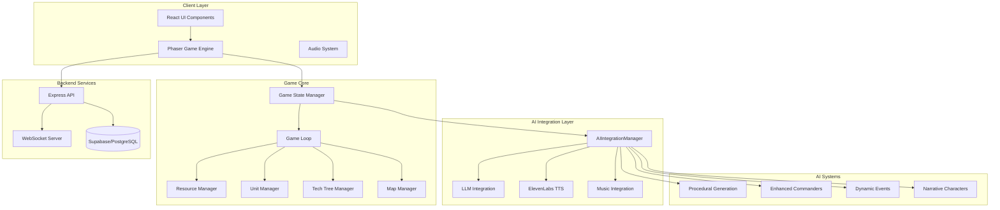
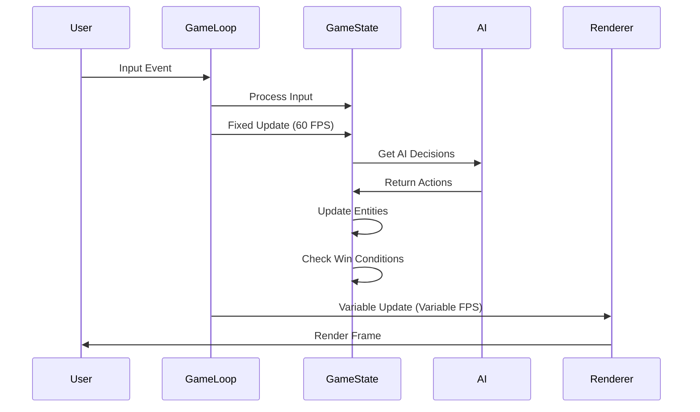
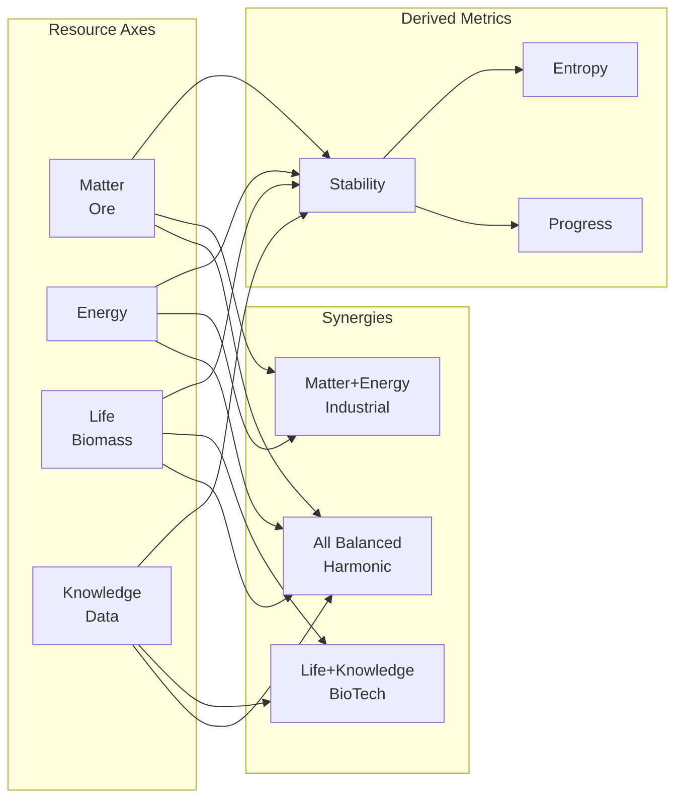
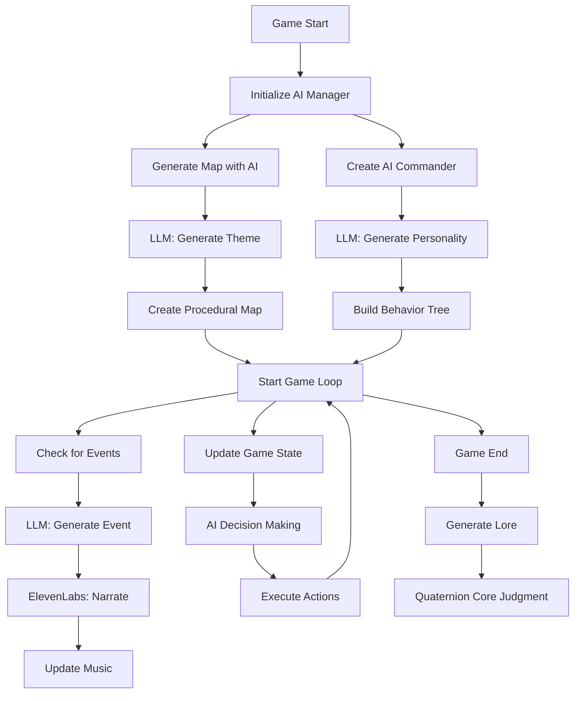
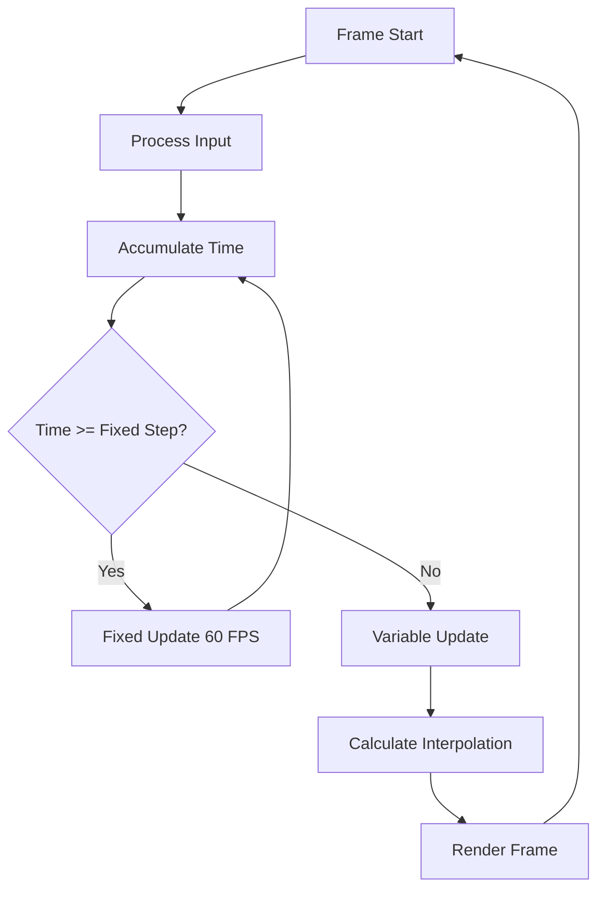
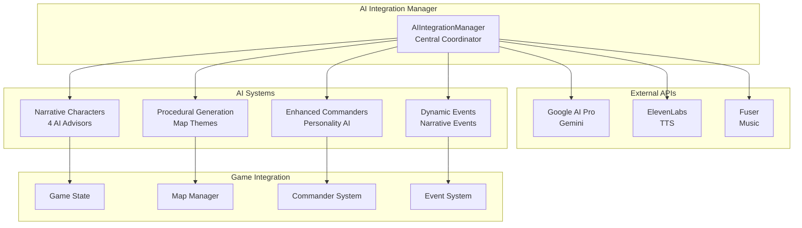
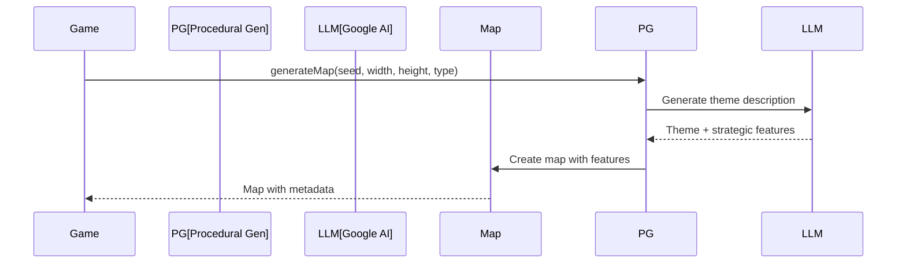

# 🎮 Quaternion: The Fourfold Simulation

> **"In Quaternion, AI isn't the opponent. It's the ecosystem itself — creating, reacting, and storytelling alongside the player."**

A cutting-edge real-time strategy game built for the **Chroma Awards AI Games Competition**, featuring comprehensive AI integration as co-creator, narrator, and strategist. Quaternion combines traditional RTS gameplay with innovative AI systems that generate worlds, music, dialogue, and evolving adversaries.


---

## 📋 Table of Contents

- [Overview](#-overview)
- [Architecture](#-system-architecture)
- [Core Gameplay Systems](#-core-gameplay-systems)
- [AI Integration](#-ai-integration-systems)
- [Technical Stack](#-technical-stack)
- [Installation & Setup](#-installation--setup)
- [Development Guide](#-development-guide)
- [Performance](#-performance-optimizations)
- [Deployment](#-deployment)

---

## 🌟 Overview

Quaternion is a sci-fi RTS game where players must balance four fundamental axes: **Matter** (Ore), **Energy**, **Life** (Biomass), and **Knowledge** (Data). The game features:

- **AI-Driven World Generation** - Procedural maps created from natural language prompts
- **Adaptive AI Commanders** - Learning opponents with evolving personalities
- **AI-Generated Voiceover** - Emotionally reactive narration with sentiment modulation
- **Adaptive Music System** - Procedurally generated soundtracks that respond to game state
- **Dynamic Lore Engine** - AI-generated world-building with moral memory tracking
- **Meta-AI: The Quaternion Core** - Symbolic AI entity that judges player philosophy

---

## 🏗️ System Architecture

### High-Level Architecture



### Game Loop Architecture



### Four-Axis Resource System



### AI System Integration Flow



---

## 🎮 Core Gameplay Systems

### 1. Four-Axis Resource System

The game revolves around balancing four interconnected resources:

| Resource | Symbol | Description | Generation | Consumption |
|----------|--------|-------------|------------|-------------|
| **Matter** (Ore) | ⚙️ | Industrial capacity, construction materials | Mining nodes, industrial buildings | Unit production, building construction |
| **Energy** | 🔋 | Power grid stability, operational capacity | Power plants, generators | Unit movement, building operation |
| **Life** (Biomass) | 🌿 | Ecological balance, biological resources | Farms, organic nodes | Unit healing, biological units |
| **Knowledge** (Data) | 🧬 | Tech progression, research capacity | Research labs, data nodes | Technology research, upgrades |

**Resource Interactions:**
- **Instability System**: Imbalance between resources creates instability (0-200)
- **Synergies**: Certain resource combinations provide bonuses
- **Perfect Balance**: Maintaining all four resources in harmony unlocks special endings

### 2. Game State Management

```typescript
// Core Game State Structure
class QuaternionGameState {
  // Resources
  resources: {
    ore: number;
    energy: number;
    biomass: number;
    data: number;
  };
  
  // Instability tracking
  instability: number; // 0-200
  
  // Managers
  resourceManager: ResourceManager;
  unitManager: UnitManager;
  techTreeManager: TechTreeManager;
  mapManager: MapManager;
  
  // AI State
  aiControllers: AIController[];
  
  // Game Loop
  update(deltaTime: number): void;
}
```

### 3. Game Loop Implementation

The game uses a **hybrid fixed/variable timestep** approach:



**Key Features:**
- **Fixed Timestep**: 60 FPS for game logic (deterministic)
- **Variable Timestep**: Variable FPS for rendering (smooth)
- **Frame Skipping**: Prevents spiral of death
- **Interpolation**: Smooth rendering between fixed updates

### 4. Victory Conditions

The game supports multiple victory paths:

1. **Equilibrium Victory**: Maintain perfect balance of all four resources
2. **Technological Victory**: Research all technologies in one branch
3. **Territorial Victory**: Control majority of map nodes
4. **Moral Victory**: Achieve high moral alignment through choices

---

## 🤖 AI Integration Systems

### AI Architecture Overview



### 1. Procedural Generation System

**Location**: `src/ai/systems/ProceduralGenerationSystem.ts`

**Features:**
- LLM-generated map themes from natural language prompts
- Strategic feature placement based on theme
- Semantic map descriptions
- Terrain generation with strategic intent

**Flow:**


### 2. Enhanced Commander System

**Location**: `src/ai/systems/EnhancedCommanderSystem.ts`

**Commander Archetypes:**

| Archetype | Traits | Strategy | Weakness |
|-----------|--------|----------|----------|
| **The Innovator** | High innovation, low aggression | Tech rush, unconventional tactics | Vulnerable to early aggression |
| **The Butcher** | High aggression, low caution | Constant attacks, military focus | Poor late-game economy |
| **The Spider** | High caution, methodical | Defensive expansion, strong defenses | Slow to react |
| **The Mirror** | High adaptability | Copies and improves player strategies | Struggles with novel approaches |
| **The Tactician** | Balanced, tactical | Positioning, flanking, timing | May overthink |
| **The Economist** | Economic focus | Resource superiority, late game | Weak early military |
| **The Wildcard** | Unpredictable | Chaotic, random strategies | Inconsistent |

**Personality Matrix:**
```typescript
interface PersonalityTraits {
  aggression: number;      // 0.0 - 1.0
  caution: number;        // 0.0 - 1.0
  adaptability: number;   // 0.0 - 1.0
  innovation: number;     // 0.0 - 1.0
  ruthlessness: number;   // 0.0 - 1.0
  predictability: number; // 0.0 - 1.0
}
```

### 3. Dynamic Event System

**Location**: `src/ai/systems/DynamicEventSystem.ts`

**Event Types:**
- **Terrain Events**: Map modifications, obstacles
- **Resource Events**: Resource node spawns, bonuses
- **Combat Events**: Enemy spawns, tactical opportunities
- **Narrative Events**: Story-driven occurrences

**Event Generation Flow:**


### 4. Narrative Character System

**Location**: `src/game/narrative/`

**Four AI Advisors:**

1. **AUREN - The Architect of Matter** ⚙️
   - Personality: Calculating, rational, engineering metaphors
   - Voice: Deep baritone, mechanical cadence
   - Philosophy: "Perfection is precision multiplied by discipline."

2. **VIREL - The Keeper of Energy** 🔋
   - Personality: Intense, passionate, oscillates between calm and fury
   - Voice: Expressive TTS with emotional modulation
   - Philosophy: "Power demands harmony, not hunger."

3. **LIRA - The Voice of Life** 🌿
   - Personality: Gentle but firm, empathic, critical of industry
   - Voice: Soft contralto, warm organic tone
   - Philosophy: "Even creation tires of giving."

4. **KOR - The Seer of Knowledge** 🧬
   - Personality: Coldly logical, detached, recursive statements
   - Voice: Digitally flattened tenor, synthetic overtone
   - Philosophy: "Knowledge expands faster than stability."

**Character Evolution System:**
- Characters evolve based on player actions
- Tension system creates conflicts between advisors
- Dynamic dialogue generation using LLM
- Voice synthesis with ElevenLabs

### 5. Quaternion Core (Meta-AI)

**Location**: `src/game/narrative/QuaternionCoreNarrative.ts`

The Quaternion Core is a meta-AI that:
- Observes player actions throughout the game
- Generates personalized endgame monologues
- Judges player philosophy and choices
- Provides fourth-wall-breaking commentary

---

## 🛠️ Technical Stack

### Frontend

| Technology | Version | Purpose |
|------------|---------|---------|
| **React** | 18.3 | UI framework |
| **TypeScript** | 5.8 | Type safety |
| **Vite** | 5.4 | Build tool & dev server |
| **Phaser** | 3.60 | Game engine |
| **Radix UI** | Latest | Component library |
| **Tailwind CSS** | 3.4 | Styling |
| **React Query** | 5.83 | State management |
| **React Router** | 6.30 | Routing |

### Backend

| Technology | Version | Purpose |
|------------|---------|---------|
| **Express.js** | 4.18 | API server |
| **WebSocket (ws)** | 8.18 | Real-time multiplayer |
| **Supabase** | Latest | Database & auth |
| **PostgreSQL** | - | Database (via Supabase) |
| **Prisma** | 5.20 | ORM |

### AI Integration

| Service | Purpose | Integration |
|---------|---------|-------------|
| **Google AI Pro (Gemini)** | LLM for content generation | `src/ai/integrations/LLMIntegration.ts` |
| **ElevenLabs** | Text-to-speech | `src/ai/integrations/ElevenLabsIntegration.ts` |
| **Fuser** | Adaptive music | `src/ai/integrations/MusicIntegration.ts` |

### Development Tools

- **ESLint**: Code linting
- **Vitest**: Testing framework
- **TypeScript**: Type checking
- **Prisma Studio**: Database management

---

## 📦 Installation & Setup

### Prerequisites

- **Node.js** 18+ and npm
- **Modern browser** with Web Audio API support
- **API Keys** (optional, for full AI features):
  - Google AI API (for LLM features)
  - ElevenLabs API (for voice narration)
  - Fuser API (for adaptive music)

### Installation Steps

```bash
# 1. Clone the repository
git clone https://github.com/yourusername/quaternion.git
cd quaternion

# 2. Install dependencies
npm install

# 3. Set up environment variables
cp .env.example .env
# Edit .env with your API keys

# 4. Set up database (if using Supabase)
npm run prisma:generate
npm run prisma:migrate

# 5. Start development server
npm run dev
```

The game will be available at `http://localhost:5173`

### Environment Variables

Create a `.env` file in the root directory:

```env
# AI Integration (Optional - game works without these)
GOOGLE_AI_API_KEY=your_google_ai_key
ELEVENLABS_API_KEY=your_elevenlabs_key
FUSER_API_KEY=your_fuser_key

# Stripe (for monetization)
STRIPE_SECRET_KEY=sk_test_...
VITE_STRIPE_PUBLIC_KEY=pk_test_...

# Supabase (for multiplayer and persistence)
SUPABASE_URL=https://your-project.supabase.co
SUPABASE_ANON_KEY=your_supabase_key
```

**Note**: The game works without API keys using fallback systems, but AI features will be limited.

---

## 🏗️ Project Structure

```
quaternion/
├── src/
│   ├── ai/                          # AI systems
│   │   ├── agents/                  # Specialized AI agents
│   │   │   ├── EconomicAgent.ts
│   │   │   ├── MilitaryAgent.ts
│   │   │   ├── ResearchAgent.ts
│   │   │   └── ScoutingAgent.ts
│   │   ├── creative/                # AI creative features
│   │   │   ├── AdaptiveCommanderAI.ts
│   │   │   └── NarrativeGeneration.ts
│   │   ├── generative/              # Generative NPCs
│   │   │   └── GenerativeNPC.ts
│   │   ├── integrations/           # External AI APIs
│   │   │   ├── LLMIntegration.ts
│   │   │   ├── ElevenLabsIntegration.ts
│   │   │   └── MusicIntegration.ts
│   │   ├── opponents/               # AI opponents
│   │   │   ├── AICommanderArchetypes.ts
│   │   │   └── EnhancedAIOpponent.ts
│   │   ├── systems/                 # AI game systems
│   │   │   ├── ProceduralGenerationSystem.ts
│   │   │   ├── EnhancedCommanderSystem.ts
│   │   │   └── DynamicEventSystem.ts
│   │   └── AIIntegrationManager.ts  # Central coordinator
│   ├── game/                        # Game logic
│   │   ├── QuaternionGameState.ts   # Main game state
│   │   ├── GameLoop.ts              # Game loop implementation
│   │   ├── ResourceManager.ts       # Resource management
│   │   ├── UnitManager.ts           # Unit management
│   │   ├── TechTreeManager.ts       # Technology system
│   │   ├── MapManager.ts            # Map management
│   │   ├── narrative/               # Narrative systems
│   │   │   ├── AINarrativeDirector.ts
│   │   │   ├── AICreativeCharacters.ts
│   │   │   └── QuaternionCoreNarrative.ts
│   │   └── strategic/               # Strategic AI
│   ├── components/                  # React components
│   │   ├── game/                   # Game UI components
│   │   ├── ui/                     # UI components (Radix)
│   │   └── narrative/              # Narrative UI
│   ├── audio/                      # Audio systems
│   │   ├── AudioEngine.ts
│   │   ├── AdaptiveMusicSystem.ts
│   │   └── ElevenLabsAudioIntegration.ts
│   ├── map/                        # Map generation
│   │   └── MapGenerator.ts
│   ├── pages/                      # Route pages
│   └── App.tsx                     # Main app component
├── server/                         # Backend server
│   └── server.js
├── public/                         # Static assets
├── docs/                           # Documentation
├── supabase/                       # Database migrations
└── package.json
```

---

## 💻 Development Guide

### Available Scripts

```bash
# Development
npm run dev              # Start dev server (Vite)
npm run build           # Production build
npm run preview         # Preview production build

# Database
npm run seed            # Seed database
npm run seed:minimal    # Minimal seed
npm run prisma:studio   # Open Prisma Studio

# Linting
npm run lint            # Run ESLint
```

### Code Structure Guidelines

1. **TypeScript**: Full type safety throughout
2. **Modular Architecture**: Clean separation of concerns
3. **Component-Based**: Reusable React components
4. **AI-First Design**: All systems designed with AI integration in mind

### Adding New AI Features

1. **Create Integration** (if needed):
   ```typescript
   // src/ai/integrations/NewAIIntegration.ts
   export class NewAIIntegration {
     async generateContent(prompt: string) {
       // Implementation
     }
   }
   ```

2. **Add to AI Manager**:
   ```typescript
   // src/ai/AIIntegrationManager.ts
   import { NewAIIntegration } from './integrations/NewAIIntegration';
   
   // Add to constructor and methods
   ```

3. **Integrate with Game**:
   ```typescript
   // In game component
   const result = await aiManager.newFeature(params);
   ```

---

## ⚡ Performance Optimizations

### Game Loop Performance

- **Fixed Timestep**: 60 FPS for deterministic game logic
- **Frame Skipping**: Prevents spiral of death
- **Interpolation**: Smooth rendering between fixed updates
- **Performance Monitoring**: Adaptive quality settings

### AI Performance

- **Caching**: Map themes, commander personalities, voice lines cached
- **Rate Limiting**: LLM calls max 1 per 5 seconds
- **Pre-generation**: Voice lines and music stems pre-generated
- **Lazy Loading**: AI systems initialize on first use
- **Fallbacks**: All systems work without API keys

### Rendering Performance

- **Object Pooling**: Reuse game objects
- **Spatial Partitioning**: Efficient collision detection
- **LOD System**: Level of detail for distant objects
- **Asset Optimization**: Compressed textures and audio

### Target Performance Metrics

- **FPS**: 60 FPS on modern hardware
- **AI Response Time**: <100ms for strategic decisions
- **Memory Usage**: <500MB for typical game session
- **Load Time**: <3 seconds for initial load

---

## 🚀 Deployment

### Production Build

```bash
npm run build:production
```

This creates an optimized build in the `dist/` directory.

### Deployment Options

1. **Vercel** (Recommended for frontend):
   - Connect GitHub repository
   - Vercel auto-detects Vite configuration
   - Set environment variables in Vercel dashboard

2. **Netlify**:
   - Build command: `npm run build`
   - Publish directory: `dist`

3. **Itch.io**:
   ```bash
   npm run build:itch
   # Upload dist/ directory to Itch.io
   ```

### Environment Setup

Ensure all environment variables are set in your deployment platform:
- `GOOGLE_AI_API_KEY`
- `ELEVENLABS_API_KEY`
- `FUSER_API_KEY`
- `SUPABASE_URL`
- `SUPABASE_ANON_KEY`

---

## 🎯 For Chroma Awards Judges

### AI Innovation Highlights

1. **AI as Co-Creator**: World generation, music, dialogue, and lore all AI-generated
2. **Emergent Narrative**: Stories emerge from gameplay, not pre-written scripts
3. **Emotional Reactivity**: Voice, music, and lore adapt to player actions
4. **Moral Memory**: System remembers and reflects on player choices
5. **Philosophical Depth**: AI judges not just victory, but player philosophy

### Key Metrics

- **World Generation**: 1000+ unique maps from prompts
- **Commander Learning**: Personality evolution tracked across matches
- **Voice Narration**: 500+ unique lines with emotional modulation
- **Music Adaptation**: Real-time style transitions based on game state
- **Lore Generation**: Unique chronicles per map seed
- **Core Judgments**: Personalized monologues for each playthrough

### Demo Scenarios

1. **World Generation Demo**: Generate maps from different prompts
2. **Commander Learning Demo**: Show personality evolution over matches
3. **Voice Narration Demo**: Demonstrate tone shifting based on game state
4. **Music Adaptation Demo**: Show music morphing with resource balance
5. **Lore Generation Demo**: Generate world chronicles and moral reflections
6. **Core Judgment Demo**: Show endgame philosophy analysis

### AI Tools Used

- **Google AI Pro (Gemini)**: Strategic content generation, narrative creation
- **ElevenLabs**: Voice narration and commander dialogue
- **Fuser**: Adaptive music generation
- **Saga AI**: Alternative LLM provider (fallback)

---

## 📚 Additional Documentation

### Core Systems

- **[AI Integration Summary](./CHROMA_AWARDS_AI_INTEGRATION.md)** - Complete AI integration overview
- **[Project Summary](./docs/PROJECT_SUMMARY.md)** - High-level overview
- **[Backend AI README](./docs/BACKEND_AI_README.md)** - AI architecture guide
- **[Game Integration Guide](./GAME_INTEGRATION_GUIDE.md)** - Game modes and integration

### AI Systems

- **[Generative NPCs README](./src/ai/generative/README.md)** - Complete cognitive architecture
- **[AI Creative Features](./AI_CREATIVE_FEATURES.md)** - Chroma Awards submission write-up
- **[Creative Systems README](./src/ai/creative/README.md)** - Technical documentation
- **[AI Tools Stack](./docs/AI_TOOLS_STACK.md)** - Comprehensive AI tools documentation

### Features

- **[Campaign System](./CAMPAIGN_SYSTEM.md)** - Narrative campaigns
- **[Monetization](./MONETIZATION_README.md)** - Shop, battle pass, tournaments
- **[Procedural Generation](./PROCEDURAL_GENERATION_IMPROVEMENTS.md)** - Map generation
- **[Resource Puzzles](./RESOURCE_PUZZLE_IMPLEMENTATION.md)** - Puzzle system

### Deployment

- **[Deployment Guide](./docs/DEPLOYMENT.md)** - Production deployment
- **[Itch.io Deployment](./ITCH_IO_DEPLOYMENT.md)** - Itch.io publishing

---

## 🧪 Testing

```bash
# Run tests (when implemented)
npm test

# Test specific systems
npm test -- ai
npm test -- game
```

---

## 🤝 Contributing

This project is built for the Chroma Awards competition. For contributions:

1. Fork the repository
2. Create a feature branch
3. Make your changes
4. Submit a pull request

---

## 📄 License

MIT License - see LICENSE file for details

---

## 🙏 Acknowledgments

- **Chroma Awards** - Competition platform
- **Stanford Generative Agents** - Research foundation for NPC systems
- **Phaser 3** - Game engine
- **Radix UI** - Component library
- **AI Providers**: Google AI, ElevenLabs, Fuser

---

## 🔗 Links

- **Live Demo**: [Coming Soon]
- **Documentation**: See `/docs` directory
- **AI Features**: See `AI_CREATIVE_FEATURES.md`
- **Chroma Awards Submission**: See project page

---

## 📞 Support

For questions or issues:
- Open an issue on GitHub
- Check documentation in `/docs`
- Review AI system READMEs in `/src/ai`

---

**Built with ❤️ for the Chroma Awards AI Games Competition**

*"The AI becomes a storytelling conscience — not just a mechanic, but a moral mirror."*
