# Quaternion - AI-Powered Real-Time Strategy Game

<div align="center">


**A next-generation RTS game featuring hybrid AI systems, procedural generation, and quaternion-based mathematics**

[Features](#-features) • [Architecture](#-system-architecture) • [Installation](#-installation) • [Documentation](#-documentation) • [Contributing](#-contributing)

</div>

---

## 📋 Table of Contents

1. [Overview](#-overview)
2. [Features](#-features)
3. [System Architecture](#-system-architecture)
4. [Technical Stack](#-technical-stack)
5. [Installation & Setup](#-installation--setup)
6. [Game Systems](#-game-systems)
7. [AI Architecture](#-ai-architecture)
8. [API Documentation](#-api-documentation)
9. [Development Guide](#-development-guide)
10. [Performance & Optimization](#-performance--optimization)
11. [Advanced Configuration](#-advanced-configuration)
12. [Deployment Guide](#-deployment-guide)
13. [Security Considerations](#-security-considerations)
14. [Troubleshooting](#-troubleshooting)
15. [Roadmap & Future Enhancements](#-roadmap--future-enhancements)

---

## 🎮 Overview

**Quaternion** is a sophisticated real-time strategy game that combines traditional RTS mechanics with cutting-edge AI systems. Built for the Chroma Awards competition, it features:

- **Hybrid AI System**: Combines deterministic utility-based AI with LLM-powered strategic decision making
- **Procedural Generation**: Quaternion-based mathematics for deterministic, seed-based map generation
- **Multi-Resource Economy**: Four-resource system (Matter, Energy, Life, Knowledge) with complex interdependencies
- **Campaign System**: Narrative-driven campaigns with AI-generated content
- **Multiplayer Support**: Real-time multiplayer with replay system
- **Tech Tree Puzzles**: Resource allocation puzzles integrated into progression

### Core Philosophy

Quaternion emphasizes **strategic depth** through:
- **Balance Mechanics**: Resource instability system that rewards careful management
- **Multiple Victory Conditions**: Equilibrium, Technological, Territorial, and Moral victories
- **Adaptive AI**: Personality-driven commanders that adapt to player behavior
- **Procedural Narrative**: AI-generated storylines that respond to player choices

---

## ✨ Features

### Gameplay Features

- ✅ **Real-Time Strategy Core**
  - 60 FPS game loop with fixed timestep
  - Unit management with formations and squad tactics
  - Building construction and production queues
  - Resource gathering and economy management

- ✅ **Four-Resource System**
  - **Matter** (Ore): Raw materials for construction
  - **Energy**: Power for advanced units and buildings
  - **Life** (Biomass): Biological resources and healing
  - **Knowledge** (Data): Research and technology advancement

- ✅ **Tech Tree & Puzzles**
  - Branching technology trees
  - Resource allocation puzzles
  - Strategic decision points
  - Unlockable units and abilities

- ✅ **Campaign System**
  - Multiple campaign missions
  - Narrative progression
  - AI-generated storylines
  - Voice narration (ElevenLabs integration)

- ✅ **Multiplayer**
  - Real-time multiplayer matches
  - Replay system with full game state recording
  - Matchmaking queue
  - Spectator mode

### AI Features

- ✅ **Hybrid AI Architecture**
  - Unit-level utility AI (<1ms per unit)
  - Squad-level coordination (FSM-based)
  - Commander-level strategic AI (LLM-powered)
  - Deterministic fallbacks for reliability

- ✅ **AI Integration**
  - Google AI Pro (Gemini) for strategic content
  - ElevenLabs for voice narration
  - Fuser for adaptive music
  - Procedural content generation

- ✅ **Personality System**
  - Multiple commander archetypes
  - Adaptive behavior based on player actions
  - Emotional modeling (OCEAN personality traits)
  - Dynamic difficulty adjustment

### Technical Features

- ✅ **Procedural Generation**
  - Quaternion-based random number generation
  - Perlin-like noise for terrain
  - Deterministic map generation
  - Symmetric start positions

- ✅ **Performance**
  - Optimized game loop with adaptive quality
  - Spatial partitioning for efficient queries
  - Lazy loading and asset management
  - Frame rate monitoring and adjustment

---

## 🏗️ System Architecture

### High-Level Architecture

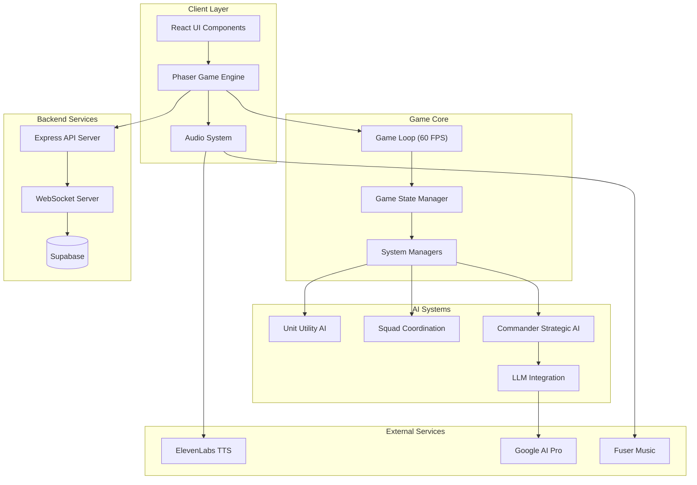

### Game State Management

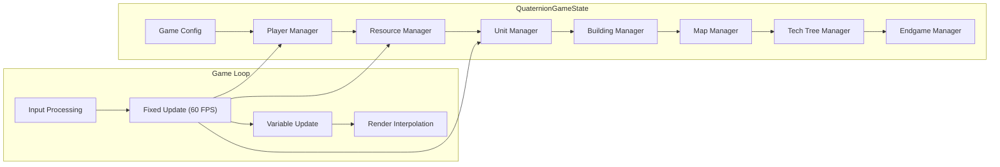

### Resource System Architecture

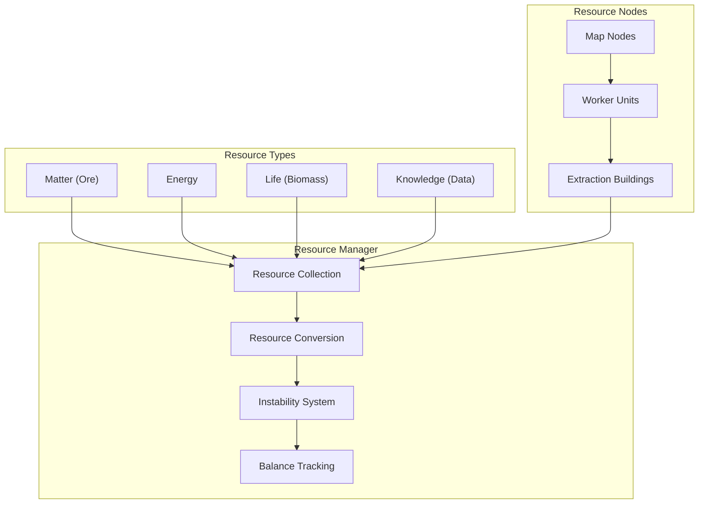

---

## 🛠️ Technical Stack

### Frontend

- **React 18.3** - UI framework
- **TypeScript 5.8** - Type safety
- **Phaser 3.60** - Game engine
- **Tailwind CSS** - Styling
- **Radix UI** - Component library
- **Vite** - Build tool

### Backend

- **Node.js** - Runtime
- **Express** - API server
- **WebSocket (ws)** - Real-time communication
- **Supabase** - Database and edge functions

### AI & External Services

- **Google AI Pro (Gemini)** - Strategic content generation
- **ElevenLabs** - Text-to-speech
- **Fuser** - Adaptive music generation

### Development Tools

- **Vitest** - Testing framework
- **ESLint** - Linting
- **TypeScript ESLint** - Type checking

---

## 📦 Installation & Setup

### Prerequisites

- **Node.js** 18+ and npm
- **Git** for version control
- **Supabase account** (for database and edge functions)

### Quick Start

```bash
# Clone the repository
git clone https://github.com/yourusername/quaternion.git
cd quaternion

# Install dependencies
npm install

# Set up environment variables
cp .env.example .env
# Edit .env with your API keys

# Start development server
npm run dev
```

### Environment Variables

Create a `.env` file in the root directory:

```env
# Supabase
VITE_SUPABASE_URL=your_supabase_url
VITE_SUPABASE_ANON_KEY=your_supabase_anon_key

# AI Services
GOOGLE_AI_API_KEY=your_google_ai_key
ELEVENLABS_API_KEY=your_elevenlabs_key
FUSER_API_KEY=your_fuser_key

# Backend
PORT=3000
NODE_ENV=development
```

### Database Setup

```bash
# Run database migrations
npm run migrate

# Seed the database
npm run seed

# Or seed minimal data
npm run seed:minimal
```

### Build for Production

```bash
# Build for production
npm run build

# Preview production build
npm run preview

# Build for Itch.io deployment
npm run build:itch
```

---

## 🎯 Game Systems

### 1. Game Loop System

The game uses a **hybrid fixed/variable timestep** approach:

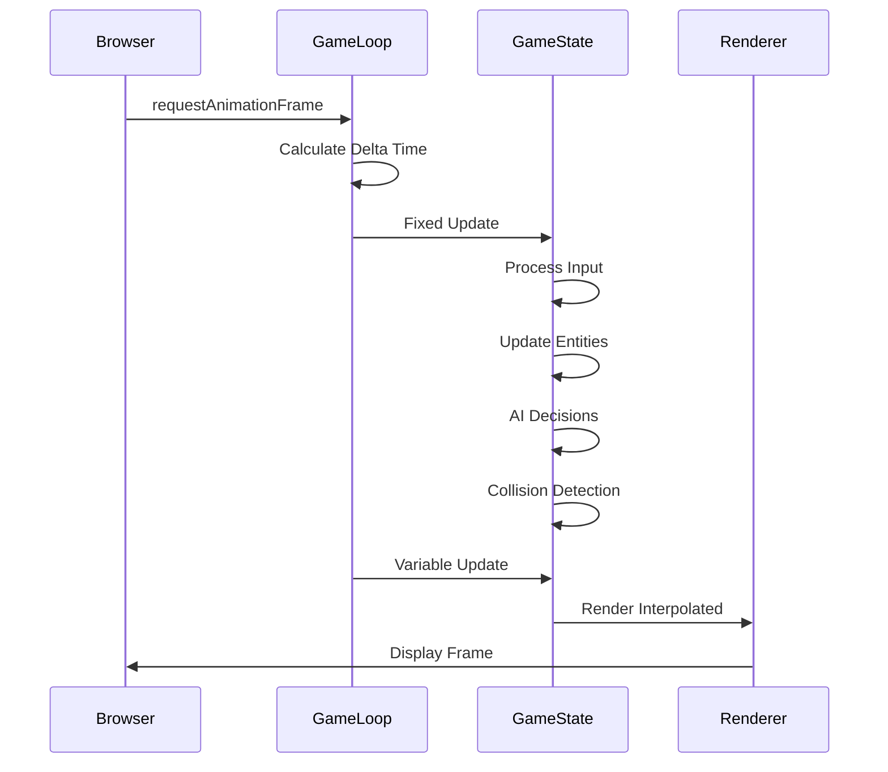

**Key Features:**
- Fixed timestep (1/60s) for deterministic game logic
- Variable timestep for smooth rendering
- Frame rate limiting and adaptive quality
- Performance monitoring and statistics

### 2. Resource Management System

The four-resource system creates strategic depth:

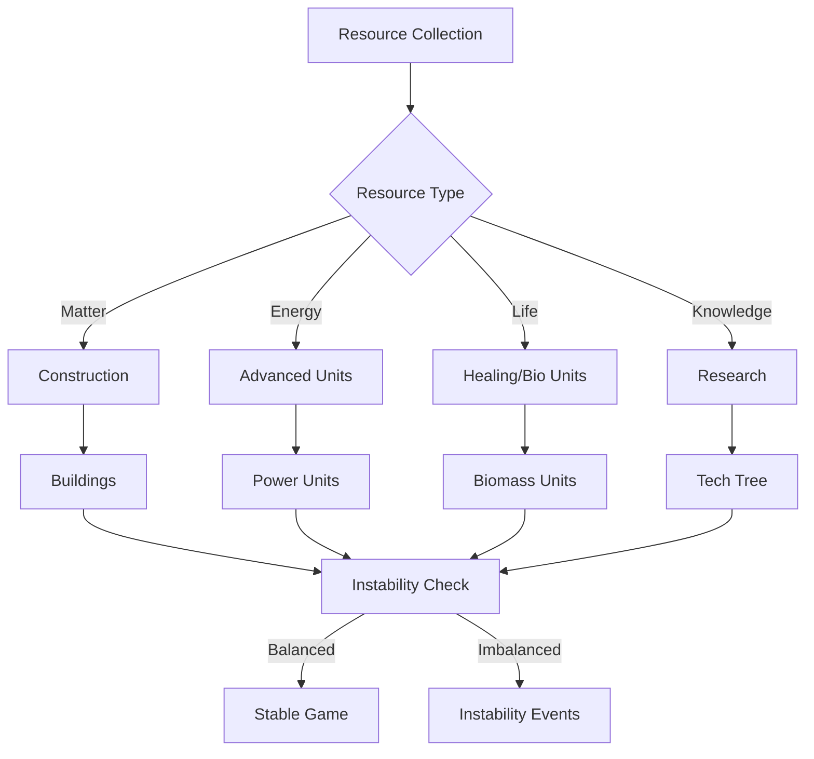

**Resource Instability:**
- Resources must be kept in balance
- Imbalance causes instability events
- Perfect balance unlocks special endings
- Strategic resource conversion mechanics

### 3. Unit System

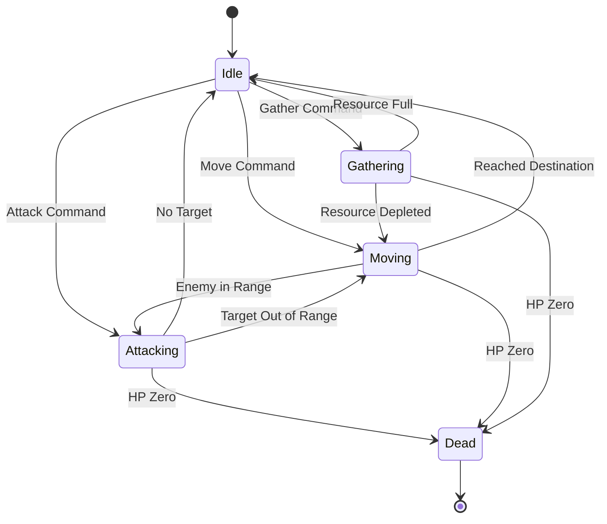

**Unit Types:**
- **Worker**: Resource gathering, construction
- **Soldier**: Basic combat unit
- **Tank**: Heavy armor, slow movement
- **Air Unit**: Fast, flying, vulnerable to anti-air

### 4. Tech Tree System

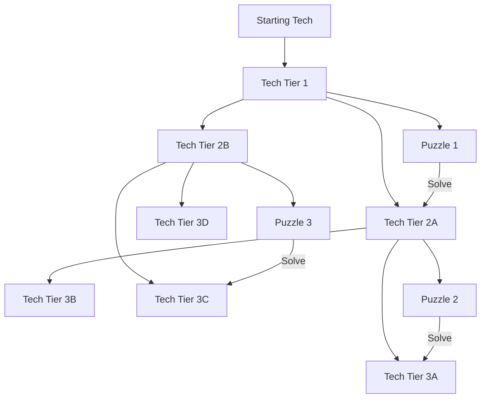

**Tech Tree Features:**
- Branching paths with choices
- Resource allocation puzzles
- Unlockable units and abilities
- Strategic decision points

### 5. Map Generation System

**Quaternion-Based Procedural Generation:**

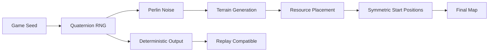

**Map Features:**
- Deterministic generation (same seed = same map)
- Terrain types: Plains, Mountains, Water
- Resource node distribution
- Strategic chokepoints
- Symmetric start positions for fairness

### 6. Multiplayer Architecture

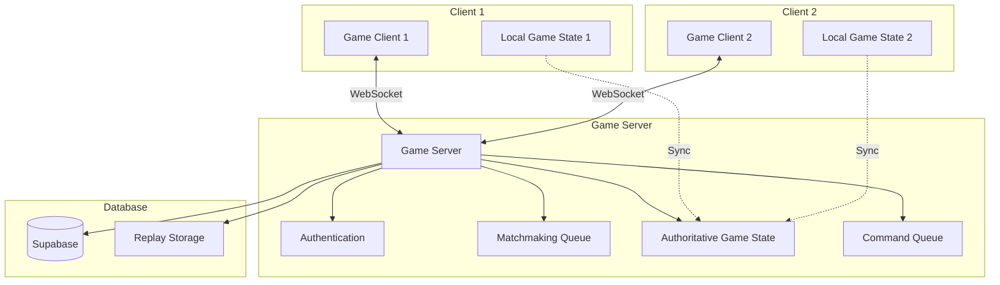

**Multiplayer Features:**
- Authoritative server architecture
- Command queue for deterministic replay
- Lag compensation
- Replay recording and playback
- Matchmaking system

### 7. Replay System

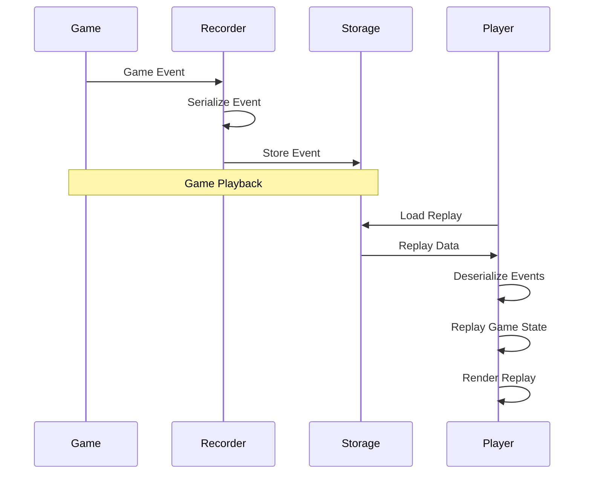

**Replay Features:**
- Full game state recording
- Deterministic playback
- Fast forward/rewind
- Analysis tools
- Shareable replay files

### 8. Campaign System Flow

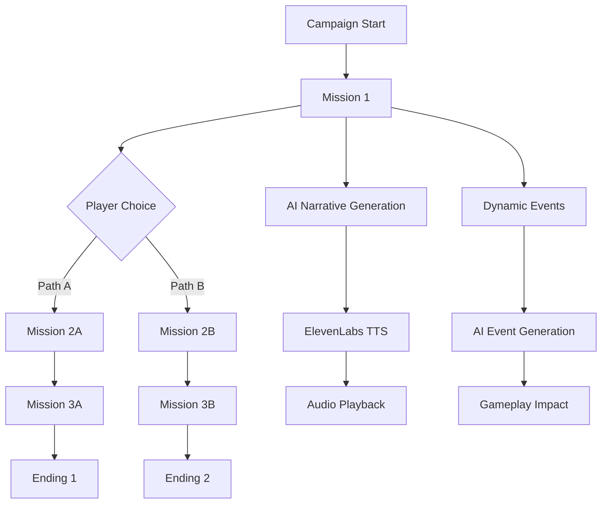

**Campaign Features:**
- Branching storylines
- AI-generated narratives
- Voice narration
- Dynamic events
- Multiple endings

### 9. Tech Tree Puzzle System

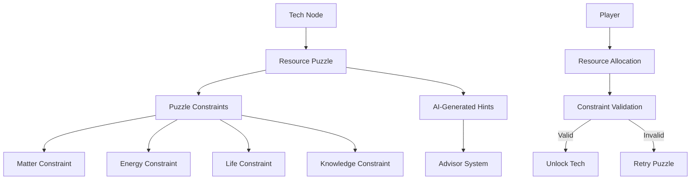

**Puzzle Features:**
- Resource allocation challenges
- Constraint-based solving
- AI-generated hints
- Multiple solution paths
- Strategic decision making

---

## 🤖 AI Architecture

### Hybrid AI System Overview

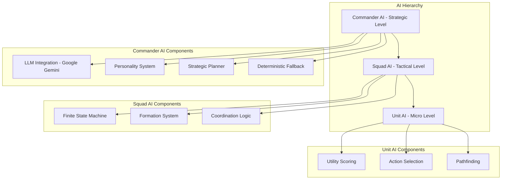

### AI Decision Flow

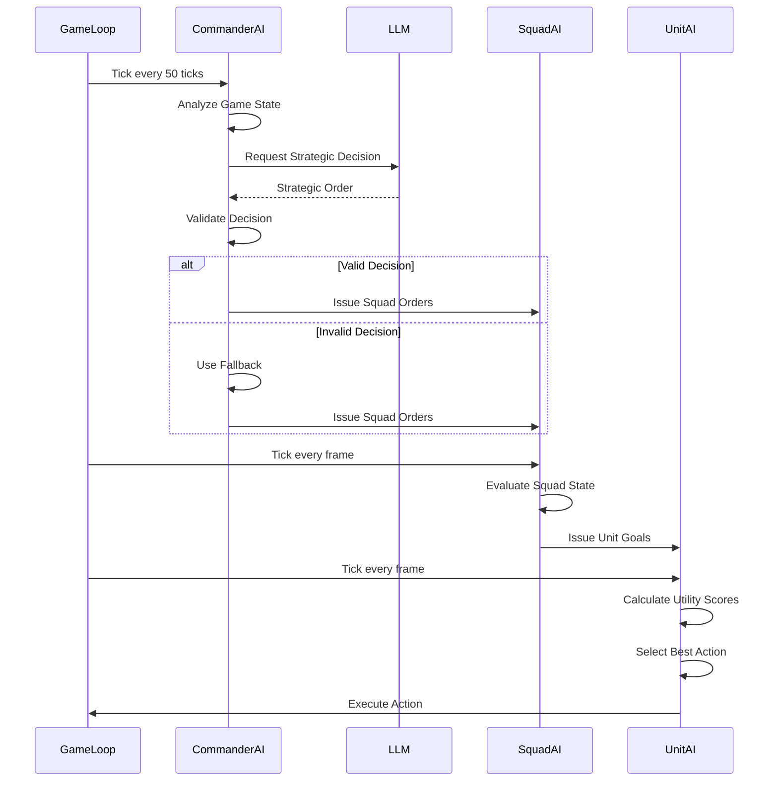

### AI Personality System

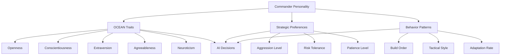

**Commander Archetypes:**
- **Cautious Geologist**: Defensive, resource-focused
- **Aggressive Commander**: Rush tactics, early pressure
- **Balanced Strategist**: Adaptive, flexible
- **Tech Specialist**: Research-focused, late-game power

### AI Integration Manager

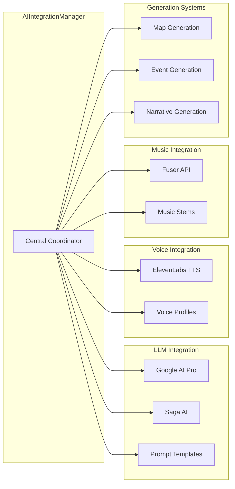

---

## 📚 API Documentation

### Game Management Endpoints

#### Create Game
```http
POST /api/game/create
Content-Type: application/json

{
  "seed": 12345,
  "mapWidth": 40,
  "mapHeight": 30,
  "mapType": "crystalline_plains",
  "aiDifficulty": "medium",
  "commanderId": "cautious_geologist"
}
```

**Response:**
```json
{
  "gameId": "game_abc123",
  "state": "created",
  "map": { ... },
  "players": [ ... ]
}
```

#### Get Game State
```http
GET /api/game/:id/state
```

**Response:**
```json
{
  "tick": 1234,
  "gameTime": 20.5,
  "players": [ ... ],
  "units": [ ... ],
  "buildings": [ ... ],
  "resources": { ... },
  "events": [ ... ]
}
```

#### Start Game
```http
POST /api/game/:id/start
```

#### Stop Game
```http
POST /api/game/:id/stop
```

### Command Endpoints

#### Move Units
```http
POST /api/game/:id/move
Content-Type: application/json

{
  "unitIds": [1, 2, 3],
  "targetX": 100,
  "targetY": 200
}
```

#### Attack Target
```http
POST /api/game/:id/attack
Content-Type: application/json

{
  "unitIds": [1, 2, 3],
  "targetId": 42
}
```

#### Build Unit
```http
POST /api/game/:id/build-unit
Content-Type: application/json

{
  "buildingId": 5,
  "unitType": "soldier"
}
```

#### Build Building
```http
POST /api/game/:id/build-building
Content-Type: application/json

{
  "buildingType": "barracks",
  "x": 150,
  "y": 150,
  "playerId": 1
}
```

### Multiplayer Endpoints

#### Create Room
```http
POST /api/rooms/create
Content-Type: application/json

{
  "playerName": "Player1",
  "maxPlayers": 2
}
```

#### Join Room
```http
POST /api/rooms/:roomId/join
Content-Type: application/json

{
  "playerName": "Player2"
}
```

#### Get Replay
```http
GET /api/replays/:replayId
```

---

## 💻 Development Guide

### Project Structure

```
quaternion/
├── src/
│   ├── game/              # Core game logic
│   │   ├── GameLoop.ts    # Game loop implementation
│   │   ├── QuaternionGameState.ts  # Main game state
│   │   ├── ResourceManager.ts      # Resource system
│   │   ├── UnitManager.ts          # Unit management
│   │   ├── TechTreeManager.ts      # Tech tree system
│   │   └── MapManager.ts           # Map management
│   ├── ai/                # AI systems
│   │   ├── AIIntegrationManager.ts # AI coordinator
│   │   ├── agents/        # AI agents
│   │   ├── generative/    # Generative AI
│   │   ├── memory/        # Memory systems
│   │   └── navigation/    # Navigation AI
│   ├── frontend/          # Frontend components
│   │   ├── GameClient.ts  # Main game client
│   │   ├── renderers/     # Rendering systems
│   │   └── scenes/        # Phaser scenes
│   ├── map/               # Map generation
│   │   ├── MapGenerator.js
│   │   └── TerrainSystem.ts
│   ├── audio/             # Audio systems
│   │   ├── MusicManager.ts
│   │   ├── SFXManager.ts
│   │   └── ttsClient.ts
│   └── utils/             # Utilities
│       └── quaternion.js  # Quaternion math
├── supabase/              # Supabase functions
│   └── functions/
│       └── ai-strategy/   # AI edge function
├── tests/                 # Test files
├── docs/                  # Documentation
└── public/                # Static assets
```

### Code Style

- **TypeScript**: Strict mode enabled
- **ESLint**: Configured with TypeScript rules
- **Naming**: camelCase for variables, PascalCase for classes
- **Comments**: JSDoc for public APIs

### Testing

```bash
# Run all tests
npm test

# Run tests in watch mode
npm test -- --watch

# Run specific test file
npm test -- game.test.js
```

### Debugging

**Enable AI Debug Logging:**
```typescript
const commander = new CommanderAI('test', gameState);
commander.enableDebugLogging();
```

**Performance Monitoring:**
```typescript
const stats = gameLoop.getPerformanceStats();
console.log('FPS:', stats.fps);
console.log('Frame Time:', stats.frameTime);
```

---

## ⚡ Performance & Optimization

### Performance Targets

- **Frame Rate**: 60 FPS target
- **Unit AI**: <0.5ms per unit
- **Squad AI**: <5ms per squad
- **Commander AI**: <100ms per decision (rate-limited)
- **Memory**: <500MB for typical game

### Optimization Strategies

1. **Spatial Partitioning**
   - Grid-based unit queries
   - Efficient nearest-neighbor searches
   - Reduced collision checks

2. **Lazy Evaluation**
   - Only evaluate visible enemies
   - Defer expensive calculations
   - Cache frequently accessed data

3. **Batch Operations**
   - Batch unit updates
   - Group rendering calls
   - Minimize API calls

4. **Adaptive Quality**
   - Reduce particle effects on low-end devices
   - Lower resolution on mobile
   - Disable non-essential features

### Monitoring

```typescript
// Enable performance monitoring
const gameLoop = new GameLoop({
  enablePerformanceMonitoring: true,
  enableAdaptiveQuality: true
});

// Get stats
const stats = gameLoop.getPerformanceStats();
```

---

## ⚙️ Advanced Configuration

### Game Configuration

```typescript
interface GameConfig {
  seed: number;                    // Map generation seed
  mapWidth: number;                // Map width in tiles
  mapHeight: number;               // Map height in tiles
  mapType: string;                 // Map type (e.g., 'crystalline_plains')
  aiDifficulty: 'easy' | 'medium' | 'hard';
  commanderId: string;             // Commander personality ID
  mode?: 'single' | 'multiplayer';
  roomId?: string;                 // Multiplayer room ID
  puzzleId?: string;               // Tech tree puzzle ID
}
```

### AI Configuration

```typescript
interface AIConfig {
  // Commander AI settings
  commander: {
    decisionInterval: number;      // Ticks between decisions (default: 50)
    llmProvider: 'google' | 'saga' | 'openai';
    fallbackEnabled: boolean;      // Use deterministic fallback
    personalityOverride?: PersonalityType;
  };
  
  // Unit AI settings
  unit: {
    utilityWeights: {
      distance: number;
      targetHp: number;
      ourHp: number;
      support: number;
      cover: number;
    };
    updateRate: number;             // Updates per tick
  };
  
  // Squad AI settings
  squad: {
    minSquadSize: number;          // Minimum units per squad
    maxSquadSize: number;          // Maximum units per squad
    formationTypes: string[];      // Available formations
  };
}
```

### Performance Configuration

```typescript
interface PerformanceConfig {
  targetFPS: number;               // Target frame rate (default: 60)
  fixedTimestep: number;           // Fixed update interval (default: 1/60)
  maxFrameSkip: number;            // Max updates per frame (default: 5)
  enableAdaptiveQuality: boolean;  // Adaptive quality scaling
  enableFrameRateLimiting: boolean; // Frame rate limiting
  qualityLevels: {
    low: QualitySettings;
    medium: QualitySettings;
    high: QualitySettings;
  };
}
```

### Resource System Configuration

```typescript
interface ResourceConfig {
  startingResources: {
    matter: number;
    energy: number;
    life: number;
    knowledge: number;
  };
  instabilityThreshold: number;    // Instability warning threshold
  maxInstability: number;          // Maximum instability before events
  conversionRates: {
    matterToEnergy: number;
    energyToLife: number;
    lifeToKnowledge: number;
    // ... other conversion rates
  };
  nodeGeneration: {
    density: number;               // Resource node density
    clustering: number;            // Clustering factor
    symmetry: boolean;             // Symmetric placement
  };
}
```

---

## 🚀 Deployment Guide

### Production Build

```bash
# Build for production
npm run build

# The build output will be in the `dist/` directory
# This includes:
# - Optimized JavaScript bundles
# - Minified CSS
# - Compressed assets
# - Service worker for offline support
```

### Deployment Options

#### Vercel Deployment

```bash
# Install Vercel CLI
npm i -g vercel

# Deploy
vercel

# Or connect GitHub repo for automatic deployments
```

**vercel.json** configuration:
```json
{
  "buildCommand": "npm run build",
  "outputDirectory": "dist",
  "rewrites": [
    { "source": "/(.*)", "destination": "/index.html" }
  ]
}
```

#### Railway Deployment

1. Connect your GitHub repository
2. Railway will auto-detect Node.js
3. Set environment variables in Railway dashboard
4. Deploy automatically on push

**railway.json** configuration:
```json
{
  "build": {
    "builder": "NIXPACKS",
    "buildCommand": "npm run build"
  },
  "deploy": {
    "startCommand": "npm start",
    "restartPolicyType": "ON_FAILURE",
    "restartPolicyMaxRetries": 10
  }
}
```

#### Docker Deployment

**Dockerfile:**
```dockerfile
FROM node:18-alpine AS builder
WORKDIR /app
COPY package*.json ./
RUN npm ci
COPY . .
RUN npm run build

FROM nginx:alpine
COPY --from=builder /app/dist /usr/share/nginx/html
COPY nginx.conf /etc/nginx/nginx.conf
EXPOSE 80
CMD ["nginx", "-g", "daemon off;"]
```

**nginx.conf:**
```nginx
server {
    listen 80;
    server_name _;
    root /usr/share/nginx/html;
    index index.html;

    location / {
        try_files $uri $uri/ /index.html;
    }

    location /api {
        proxy_pass http://backend:3000;
        proxy_http_version 1.1;
        proxy_set_header Upgrade $http_upgrade;
        proxy_set_header Connection 'upgrade';
        proxy_set_header Host $host;
        proxy_cache_bypass $http_upgrade;
    }
}
```

### Environment Variables for Production

```env
# Production environment
NODE_ENV=production

# Supabase (Production)
VITE_SUPABASE_URL=https://your-project.supabase.co
VITE_SUPABASE_ANON_KEY=your_production_anon_key

# AI Services
GOOGLE_AI_API_KEY=your_production_key
ELEVENLABS_API_KEY=your_production_key
FUSER_API_KEY=your_production_key

# Backend
PORT=3000
CORS_ORIGIN=https://your-domain.com

# Security
SESSION_SECRET=your_secret_key
JWT_SECRET=your_jwt_secret
```

### Database Migration

```bash
# Run migrations in production
npm run migrate:production

# Or using Supabase CLI
supabase db push
```

### Monitoring & Logging

**Recommended Services:**
- **Sentry** - Error tracking
- **LogRocket** - Session replay
- **Datadog** - Performance monitoring
- **New Relic** - APM

**Integration Example:**
```typescript
import * as Sentry from "@sentry/react";

Sentry.init({
  dsn: "your_sentry_dsn",
  environment: process.env.NODE_ENV,
  tracesSampleRate: 1.0,
});
```

---

## 🔒 Security Considerations

### Client-Side Security

1. **API Key Protection**
   - Never expose sensitive API keys in client code
   - Use environment variables for all keys
   - Implement server-side proxies for sensitive operations

2. **Input Validation**
   ```typescript
   import { z } from 'zod';
   
   const gameCommandSchema = z.object({
     unitIds: z.array(z.number()).min(1).max(100),
     targetX: z.number().min(0).max(10000),
     targetY: z.number().min(0).max(10000),
   });
   
   const validated = gameCommandSchema.parse(userInput);
   ```

3. **XSS Prevention**
   - Sanitize all user inputs
   - Use React's built-in XSS protection
   - Avoid `dangerouslySetInnerHTML`

### Server-Side Security

1. **Authentication**
   ```typescript
   // JWT token validation
   import jwt from 'jsonwebtoken';
   
   function validateToken(token: string) {
     return jwt.verify(token, process.env.JWT_SECRET!);
   }
   ```

2. **Rate Limiting**
   ```typescript
   import rateLimit from 'express-rate-limit';
   
   const apiLimiter = rateLimit({
     windowMs: 15 * 60 * 1000, // 15 minutes
     max: 100 // limit each IP to 100 requests per windowMs
   });
   
   app.use('/api/', apiLimiter);
   ```

3. **CORS Configuration**
   ```typescript
   app.use(cors({
     origin: process.env.CORS_ORIGIN || 'http://localhost:5173',
     credentials: true,
     methods: ['GET', 'POST', 'PUT', 'DELETE'],
   }));
   ```

4. **SQL Injection Prevention**
   - Use parameterized queries
   - Supabase client handles this automatically
   - Never concatenate user input into SQL

### Data Privacy

1. **User Data**
   - Encrypt sensitive user data
   - Implement GDPR compliance
   - Provide data export/deletion

2. **Replay Data**
   - Sanitize replay files before storage
   - Remove sensitive information
   - Implement access controls

---

## 🔧 Troubleshooting

### Common Issues

#### Game Loop Not Running

**Symptoms:** Game freezes, no updates

**Solutions:**
```typescript
// Check game loop state
console.log(gameLoop.getState());

// Ensure callbacks are set
gameLoop.setCallbacks({
  fixedUpdate: (delta) => { /* ... */ },
  render: (interpolation) => { /* ... */ }
});

// Start the loop
gameLoop.start();
```

#### AI Not Making Decisions

**Symptoms:** Commander AI not responding

**Solutions:**
1. Check API keys are set:
   ```bash
   echo $GOOGLE_AI_API_KEY
   ```

2. Enable debug logging:
   ```typescript
   commander.enableDebugLogging();
   ```

3. Check rate limiting:
   ```typescript
   // Reduce decision interval for testing
   commander.setDecisionInterval(10);
   ```

4. Verify fallback is working:
   ```typescript
   // Force fallback mode
   commander.setUseFallback(true);
   ```

#### Performance Issues

**Symptoms:** Low FPS, laggy gameplay

**Solutions:**

1. **Enable Performance Monitoring:**
   ```typescript
   const stats = gameLoop.getPerformanceStats();
   console.log('FPS:', stats.fps);
   console.log('Frame Time:', stats.frameTime);
   ```

2. **Reduce Unit Count:**
   ```typescript
   // Limit active units
   const maxUnits = 100;
   if (units.length > maxUnits) {
     // Remove oldest units or reduce spawn rate
   }
   ```

3. **Enable Adaptive Quality:**
   ```typescript
   gameLoop.setConfig({
     enableAdaptiveQuality: true
   });
   ```

4. **Optimize Rendering:**
   ```typescript
   // Use object pooling
   // Reduce particle effects
   // Lower texture resolution
   ```

#### Database Connection Issues

**Symptoms:** Cannot connect to Supabase

**Solutions:**

1. **Verify Environment Variables:**
   ```bash
   # Check .env file
   cat .env | grep SUPABASE
   ```

2. **Test Connection:**
   ```typescript
   import { createClient } from '@supabase/supabase-js';
   
   const supabase = createClient(
     process.env.VITE_SUPABASE_URL!,
     process.env.VITE_SUPABASE_ANON_KEY!
   );
   
   // Test connection
   const { data, error } = await supabase.from('games').select('count');
   console.log('Connection:', error ? 'Failed' : 'Success');
   ```

3. **Check Network:**
   - Verify firewall settings
   - Check CORS configuration
   - Ensure Supabase project is active

#### Build Errors

**Symptoms:** `npm run build` fails

**Solutions:**

1. **Clear Cache:**
   ```bash
   rm -rf node_modules
   rm -rf dist
   npm cache clean --force
   npm install
   ```

2. **Check TypeScript Errors:**
   ```bash
   npx tsc --noEmit
   ```

3. **Fix ESLint Errors:**
   ```bash
   npm run lint -- --fix
   ```

### Debug Mode

Enable comprehensive debug logging:

```typescript
// Enable all debug features
const debugConfig = {
  gameLoop: true,
  ai: true,
  resources: true,
  units: true,
  network: true,
};

// Set debug mode
gameState.setDebugMode(debugConfig);
```

### Performance Profiling

```typescript
// Chrome DevTools Performance Profiler
// 1. Open Chrome DevTools
// 2. Go to Performance tab
// 3. Click Record
// 4. Play game for 10-30 seconds
// 5. Stop recording
// 6. Analyze flame graph

// Or use built-in profiler
import { performance } from 'perf_hooks';

const start = performance.now();
// ... code to profile ...
const end = performance.now();
console.log(`Execution time: ${end - start}ms`);
```

---

## 🗺️ Roadmap & Future Enhancements

### Short-Term (Next Release)

- [ ] **Enhanced AI Personalities**
  - More commander archetypes
  - Dynamic personality evolution
  - Learning from player behavior

- [ ] **Improved Graphics**
  - Particle effects system
  - Dynamic lighting
  - Improved unit animations

- [ ] **Campaign Expansion**
  - Additional campaign missions
  - Branching storylines
  - Multiple endings

### Medium-Term (3-6 Months)

- [ ] **Reinforcement Learning**
  - RL-based unit micro
  - MCTS for tactical planning
  - Self-play training

- [ ] **Advanced Multiplayer**
  - Ranked matchmaking
  - Tournament system
  - Spectator mode improvements

- [ ] **Modding Support**
  - Map editor
  - Custom unit creation
  - Mod API

### Long-Term (6+ Months)

- [ ] **3D Graphics**
  - WebGL rendering
  - 3D terrain generation
  - Improved visual effects

- [ ] **Mobile Support**
  - Touch controls
  - Mobile-optimized UI
  - Performance optimizations

- [ ] **Cloud Gaming**
  - Server-side rendering
  - Low-latency streaming
  - Cross-platform play

### Research Areas

- **Procedural Narrative Generation**
  - AI-generated quests
  - Dynamic story adaptation
  - Player choice consequences

- **Advanced AI Techniques**
  - Multi-agent reinforcement learning
  - Hierarchical planning
  - Transfer learning between commanders

- **Social Features**
  - Guild system
  - Cooperative campaigns
  - Community challenges

---

## 🔬 Implementation Details

### Quaternion Mathematics

The game uses quaternion-based mathematics for deterministic random number generation:

```typescript
class Quaternion {
  constructor(w = 1, x = 0, y = 0, z = 0) {
    this.w = w;
    this.x = x;
    this.y = y;
    this.z = z;
  }
  
  // Generate deterministic random number
  random(): number {
    // Quaternion rotation for RNG
    const temp = this.multiply(new Quaternion(0.5, 0.5, 0.5, 0.5));
    this.normalize();
    return (this.w + this.x + this.y + this.z) / 4;
  }
}
```

**Benefits:**
- Deterministic: Same seed produces same sequence
- Replay compatible: Perfect for game replays
- High quality: Better distribution than simple RNG
- Efficient: Fast computation

### Game Loop Implementation

```typescript
class GameLoop {
  private fixedTimestep = 1/60; // 60 FPS
  private accumulatedTime = 0;
  
  update(currentTime: number) {
    const deltaTime = currentTime - this.lastTime;
    this.lastTime = currentTime;
    
    // Accumulate time
    this.accumulatedTime += deltaTime;
    
    // Fixed timestep updates
    while (this.accumulatedTime >= this.fixedTimestep) {
      this.fixedUpdate(this.fixedTimestep);
      this.accumulatedTime -= this.fixedTimestep;
    }
    
    // Variable timestep for rendering
    const interpolation = this.accumulatedTime / this.fixedTimestep;
    this.render(interpolation);
  }
}
```

### Resource Instability System

```typescript
class ResourceManager {
  calculateInstability(): number {
    const resources = [matter, energy, life, knowledge];
    const mean = resources.reduce((a, b) => a + b) / 4;
    const variance = resources.reduce((sum, r) => {
      return sum + Math.pow(r - mean, 2);
    }, 0) / 4;
    
    // Instability increases with variance
    return Math.sqrt(variance) / mean;
  }
  
  checkInstabilityEvents(): void {
    if (this.instability > this.maxInstability) {
      this.triggerInstabilityEvent();
    }
  }
}
```

### AI Utility Scoring

```typescript
class UtilityAgent {
  evaluateAction(action: Action, gameState: GameState): number {
    let score = 0;
    
    // Distance factor
    const distance = this.calculateDistance(action.target);
    score += (1 - distance / maxDistance) * 0.3;
    
    // Target HP factor
    const targetHp = action.target.hp / action.target.maxHp;
    score += targetHp * 0.2;
    
    // Our HP factor
    const ourHp = this.unit.hp / this.unit.maxHp;
    score += (1 - ourHp) * 0.2; // Prefer attacking when low HP
    
    // Support factor
    const nearbyAllies = this.countNearbyAllies();
    score += Math.min(nearbyAllies / 5, 1) * 0.2;
    
    // Cover factor
    const coverBonus = this.calculateCoverBonus();
    score += coverBonus * 0.1;
    
    return score;
  }
}
```

### Command Validation

```typescript
function validateCommand(command: GameCommand, gameState: GameState): boolean {
  // Check command type
  if (!VALID_COMMANDS.includes(command.type)) {
    return false;
  }
  
  // Check player ownership
  if (command.playerId !== gameState.currentPlayer.id) {
    return false;
  }
  
  // Check resources
  if (command.type === 'build' && !hasResources(command, gameState)) {
    return false;
  }
  
  // Check unit availability
  if (command.type === 'move' && !unitsExist(command.unitIds, gameState)) {
    return false;
  }
  
  // Check target validity
  if (command.targetId && !targetExists(command.targetId, gameState)) {
    return false;
  }
  
  return true;
}
```

---

## 📊 System Metrics & Monitoring

### Key Performance Indicators

```typescript
interface SystemMetrics {
  // Game Performance
  fps: number;                    // Frames per second
  ups: number;                    // Updates per second
  frameTime: number;              // Average frame time (ms)
  updateTime: number;             // Average update time (ms)
  
  // AI Performance
  aiDecisionTime: number;         // Average AI decision time (ms)
  llmCallLatency: number;         // LLM API call latency (ms)
  aiCacheHitRate: number;         // AI decision cache hit rate
  
  // Network Performance
  networkLatency: number;         // Average network latency (ms)
  packetLoss: number;             // Packet loss percentage
  bandwidthUsage: number;         // Bandwidth usage (KB/s)
  
  // Resource Usage
  memoryUsage: number;            // Memory usage (MB)
  cpuUsage: number;               // CPU usage percentage
  gpuUsage: number;               // GPU usage percentage
}
```

### Monitoring Dashboard

```typescript
// Real-time metrics display
function displayMetrics(metrics: SystemMetrics) {
  console.table({
    'FPS': metrics.fps.toFixed(2),
    'Frame Time': `${metrics.frameTime.toFixed(2)}ms`,
    'AI Decision': `${metrics.aiDecisionTime.toFixed(2)}ms`,
    'Memory': `${metrics.memoryUsage.toFixed(2)}MB`,
    'CPU': `${metrics.cpuUsage.toFixed(2)}%`,
  });
}
```

---

## 📖 Additional Documentation

- **[Backend AI README](./docs/BACKEND_AI_README.md)** - Complete AI architecture
- **[Backend AI Quick Start](./docs/BACKEND_AI_QUICK_START.md)** - Quick reference
- **[Project Summary](./docs/PROJECT_SUMMARY.md)** - Project overview
- **[Deployment Guide](./docs/DEPLOYMENT.md)** - Deployment instructions
- **[Replay System](./docs/REPLAY_README.md)** - Replay system documentation

---

## 🤝 Contributing

Contributions are welcome! Please:

1. Fork the repository
2. Create a feature branch (`git checkout -b feature/amazing-feature`)
3. Commit your changes (`git commit -m 'Add amazing feature'`)
4. Push to the branch (`git push origin feature/amazing-feature`)
5. Open a Pull Request

### Development Guidelines

- Follow TypeScript best practices
- Write tests for new features
- Update documentation
- Follow the existing code style

---

## 📄 License

This project is licensed under the MIT License - see the LICENSE file for details.

---

## 🙏 Acknowledgments

- Built for the **Chroma Awards** AI Games competition
- Uses **Phaser 3** game engine
- AI powered by **Google AI Pro** and **ElevenLabs**
- Music by **Fuser**

---

<div align="center">

**Made with ❤️ for the Chroma Awards**

[Report Bug](https://github.com/yourusername/quaternion/issues) • [Request Feature](https://github.com/yourusername/quaternion/issues) • [Documentation](./docs/)

</div>
